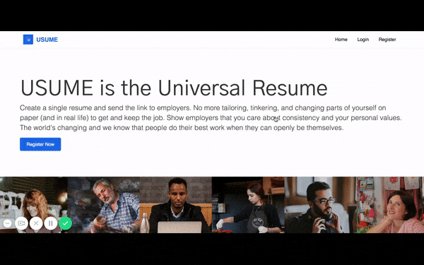

# USUME Full-Stack Application

USUME is a work-in-progress resume building website that currently offers registration, log-in and log-out, and automatic formatting of your inputted content. 

Future functionality will include the ability to edit content populated onto the resume page, shareable public links to be sent to hiring managers, and more questions added for users to answer and get closer to being hired at their ideal job. 

Read the day-to-day build notes here:

[Build notes on falondarville.com](https://falondarville.com/development-notes-for-usume/)

The application is deployed on Heroku. Please note that if the application is throwing an error at the time of access, it is likely because I am using a free version of Heroku so the "dynos" are asleep. They will wake up after some time, and you will be able to use the application. 

[Heroku application](https://cryptic-mesa-93686.herokuapp.com/)

You can also see a silent demo of the application here:

[Vimeo silent walkthrough](https://vimeo.com/269568456)

The following is a presentation of the application:

[Slideshow](http://slides.com/falondarville/deck)

## Technologies and Methodologies Used

HTML/CSS, JavaScript, React.js, Express.js, Node.js, MySQL, MVC, axios, react-bootstrap (Bootstrap 3), react-router, Heroku for deployment, bcrypt, Passport

## Challenges and Learning Summary

This was the first time I had ever touched React.js. So I spend the first two days setting up the application for React and Express and building out the front end. I kept a log of all of the steps that it took to build this application, as it was the most robust that I had built to date. 

This was also the first time that I have dealt with storing passwords in a database. I wanted to store them securely, so went with bcrypt. When a user logs in, their password is checked against the encrypted password in the database. 

I created everything from the idea, design, database schema, server configuration, front-end functionality, validation, and more. The entire application was built over the course of eight full days. The biggest challenge I came across was finding the proper resources for completing the project. I thoroughly enjoyed planning the application and determining the steps I needed to incrementally build out the functionality I was intending. I made daily lists on paper of the tasks I was planning to accomplish, and found that I continuously resolved issues ahead of schedule. 

I am thankful to have had several people to help answer some of my questions, especially regarding the relationship between React and Express. 